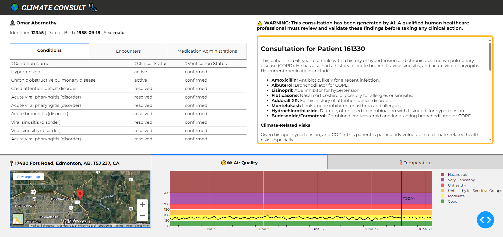

# Climate Consult - An Introduction

2023 was Canada's worst fire season ever at 18.5 million hectares burned. By early July, American researchers declared 2023 as the worst season in terms of smoke exposure per U.S. resident. During the worst air quality days, emergency department visits rose sharply for asthma-related symptoms in cities like Calgary and New York. With research indicating that climate change is likely to increase the prevalence and intensity of wildfires, physicians and researchers are indicating that wildfire smoke exposure is an emerging public health threat. *But who is most vulnerable to this threat?*

Climate Consult is a SMART on FHIR web app offering healthcare professionals an AI-assisted assessment of their patient's exposure to poor air quality, their risk factors, and possible clinical interventions. It's designed to be launched within their EHR interfaces with one click, presenting a patient-level visualization of the patient's demographics, air quality history and forecast for their primary address, health conditions, medication history, and a comprehensive AI consultation.



# Getting Started
1.  Install Python, Git, and Docker Desktop on your machine.
2.	Clone this Git repository to a local folder of your choosing.
3.	Create a python virtual environment in the root folder called "venv". Activate the virtual environment and install all dependencies in the requirements.txt file.
4.  Create a Google Cloud Project and enable the Google Maps APIs and Google Gemini APIs. Acquire the API keys for these services.

5.	Clone this repository and run it locally using Docker: https://github.com/smart-on-fhir/smart-dev-sandbox. This application will be your locally running FHIR server that you can use to test Climate Consult.

# Build and Test
1. Configure the .env file with the relevant details of your locally running smart-dev-sandbox application, then run app.py with 'python app.py'. You may also want to set the environment variables "FLASK_ENV" and "FLASK_DEBUG" to "development" and 1, respectively.

Here's an example for configuring .env:
```
# Flask secret key
SECRET_KEY='123abc'

# Logging level
LOGGING_LEVEL='DEBUG'

# SMART on FHIR configuration. 'launch_token' added at runtime
APP_ID='my_client_id'
APP_SECRET='123abc'
API_BASE='http://localhost:4013/v/r4/fhir'
REDIRECT_URI='http://localhost:5000/redirect_uri'
SCOPE='fhirUser openid online_access user/Patient.read user/Condition.read user/Medication.read user/MedicationAdministration.read user/Practitioner.read'

# Google API configuration
GOOGLE_MAPS_API_KEY='456def'
GOOGLE_GEMINI_API_KEY='789ghi'
GOOGLE_GEMINI_MODEL='gemini-1.5-pro'
```
2. Use the launcher application running in Docker to test app.py's EHR Launch workflow.